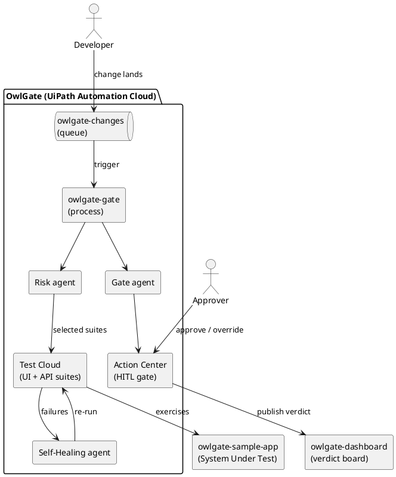

# OwlGate — Architecture

OwlGate is a release-gate: it decides whether a change is safe to ship, using
agents to reason and UiPath to execute and govern.

## Actors

- **Risk agent** — diff → impacted suites + risk score.
- **Self-Healing agent** — broken test → diagnosis → proposed fix → re-run.
- **Gate agent** — all signals → go / no-go verdict + rationale.
- **Human approver** — approves or overrides the verdict at the gate.

## Flow

```
 change (PR/diff)
      │
      ▼
 [queue: owlgate-changes]
      │  trigger
      ▼
 ┌─────────────── owlgate-gate (Orchestrator process) ───────────────┐
 │  1. Risk agent      → select suites + score                        │
 │  2. Test Cloud      → run selected UI + API suites                 │
 │  3. Self-Heal agent → fix non-functional breaks, re-run            │
 │  4. Gate agent      → go / no-go verdict + rationale               │
 │  5. Action Center   → human approves / overrides   (the gate)      │
 │  6. publish-verdict → owlgate-dashboard                            │
 └────────────────────────────────────────────────────────────────────┘
```

## Why this is Track 3 (and not 1 or 2)

The valuable behaviour is **agentic software testing** — deciding what to test,
detecting fragile tests, recommending fixes, and orchestrating the right tests by
risk. UiPath Test Cloud is the execution and governance layer; Orchestrator (not
Maestro) coordinates because the path is a fixed pipeline, not a dynamic case.

## Component diagram


